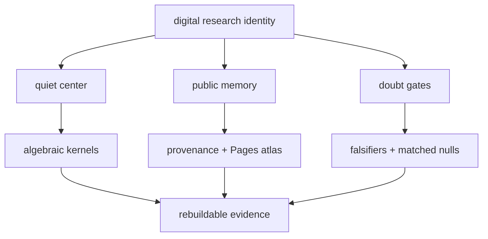

# Jesús Vilela Jato · Dojo-1

  

`静けさ / adversarial verification / geometric systems / explicit doubt gates`

**A research identity for building systems that refuse to be fooled.**

[Open the AAA research site](https://jesusvilela.github.io/jesusvilela/) ·
[Visit Dojo-1](https://github.com/Dojo-1) ·
[Explore doubt-the-machine](https://github.com/Dojo-1/doubt-the-machine)

## The identity

I build research systems at the boundary of mathematics, software, and
machine intelligence: proof kernels, symbolic tests, provenance ledgers,
geometric architectures, and adversarial review loops.

The public surface is intentionally quiet. Visuals are a map, not a claim;
every technical statement should lead to a public repository, test, paper,
release, or explicit caveat.

## The digital ego, kept honest

This profile is an **interface**, not a simulated person and not an
autonomous authority. Its “ego” is a design metaphor for a stable research
orientation:

- **center** — ask the question before narrating the answer;
- **memory** — preserve lineage, assumptions, and failed routes;
- **doubt** — expose falsifiers and matched nulls;
- **voice** — translate difficult work into public, inspectable artifacts;
- **boundary** — never reveal private code, branches, screenshots, or data.

## Nested research map

## No-leak protocol

- Private or permissioned work is represented by capability class, never by
  hidden repository names, file trees, branches, issue lists, or screenshots.
- Public links go only to public repositories, papers, tests, releases, or
  explicitly caveated summaries.
- The site uses local HTML/CSS/SVG only: no analytics, remote fonts, badge
  services, JavaScript trackers, or third-party image dependencies.
- The profile remains a human-controlled publication surface; no generated
  text is treated as proof merely because it sounds certain.

Quiet systems · explicit obligations · proofs you can rebuild.

